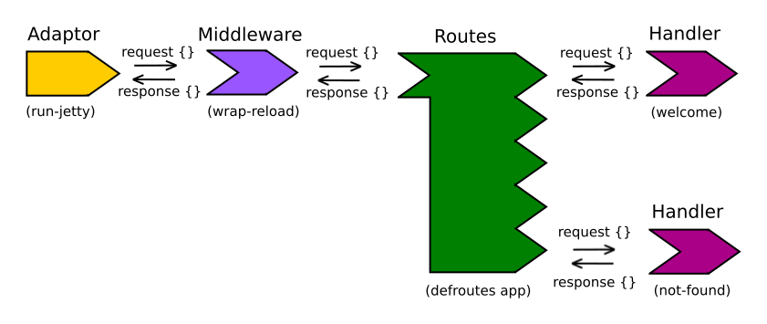

## Application Logic

> #### TODO::work in progress, sorry
> Just notes at the moment

* [Routing](application-logic/routing.md)
* [Requests](application-logic/requests/index.md)
* [Responses](application-logic/responses/index.md)
* [handlers](application-logic/handlers/index.md)
* [middleware](application-logic/middleware/index.md)
* [Serving static content](app-servers/static-content.md)

  <!-- * **routing** - running different code depending on the URL path recieved -->
  <!-- * **http method switching** - running different code based on the HTTP method (GET, POST, PUT, DELETE) -->

## Ring
Ring is the defacto library for server-side web applications.  Even if not using the Ring library, the contents that Ring established are used by other libraries.

## Compojure
  [Compojure](https://github.com/weavejester/compojure) is a library that works with Ring to manage
  Compojure also has convienience functions that make ring responses easier to generate.

  In this section we will update our project to use Compojure.

## Bidi - Bi-directional URI dispatch
https://github.com/juxt/bidi
Clojure and ClojureScript

bidi is written to do 'one thing well' (URI dispatch and formation) and is intended for use with Ring middleware, HTTP servers (including Jetty, http-kit and aleph) and is fully compatible with Liberator.

## yada - resources as data
[yada](https://github.com/juxt/yada) is a web library for Clojure, designed to support the creation of production services via HTTP.

It has the following features:

* Standards-based, comprehensive HTTP coverage (content negotiation, conditional requests, etc.)
* Parameter validation and coercion, automatic Swagger support
* Rich extensibility (methods, mime-types, security and more)
* Asynchronous, efficient interceptor-chain design built on manifold
* Excellent performance, suitable for heavy production workloads

yada is a sibling library to bidi - whereas bidi is based on routes as data, yada is based on resources as data.

## Reitit
A data approach to routing
