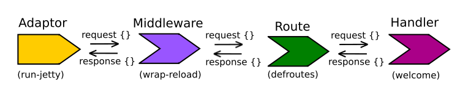

# Using Compojure in the project

Let's add a `defroute` function to define routes and their associated handlers.



## Add Compojure to the namespace

> **Note** Add the `defroutes` function, `GET` protocol and `not-found` route from Compojure to the namespace

```clojure
(ns todo-list.core
  (:require [ring.adapter.jetty :as jetty]
            [ring.middleware.reload :refer [wrap-reload]]
            [compojure.core :refer [defroutes GET]]
            [compojure.route :refer [not-found]]))
```

## Refactor the welcome function to just say Hello

> **Note** The welcome function should just do one simple thing, return a welcome message.

```clojure 
(defn welcome
  "A ring handler to respond with a simple welcome message"
  [request]
  {:status 200
     :body "<h1>Hello, Clojure World</h1>  
     <p>Welcome to your first Clojure app, I now update automatically</p>"
     <p>I now use defroutes to manage incoming requests</p>
   :headers {}})
```

## Add a defroutes function 

> **Note** Add a `defroutes` function called `app` to manage our routes.  Add routes for `/` and send all other requests to the Compojure `not-found` function.

```clojure
(defroutes app
  (GET "/" [] welcome)
  (not-found "<h1>This is not the page you are looking for</h1> 
              <p>Sorry, the page you requested was not found!</p>"))
```

## Update -dev-main and -main functions 

 > **Note** Change the `-dev-main` and `-main` functions to call the `app` function, instead of the `welcome` function

```clojure
(defn -main
  "A very simple web server using Ring & Jetty"
  [port-number]
  (jetty/run-jetty app
     {:port (Integer. port-number)}))

(defn -dev-main
  "A very simple web server using Ring & Jetty that reloads code changes via the development profile of Leiningen"
  [port-number]
  (jetty/run-jetty (wrap-reload #'app)
     {:port (Integer. port-number)}))
```

  As we have changed the `-dev-main` and `-main` functions, we need to restart the server again - `Ctrl-c` then `lein run 8000`
  
  Now test out your updated web app by visiting http://localhost:8000 and http://localhost:8000/not-there
  
