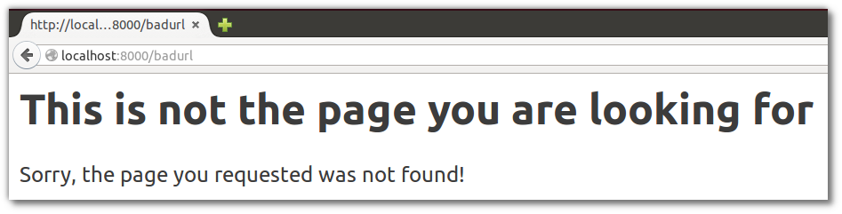

# Add Error message when request not found

So far our app has responded with the same message, regardless of the web address (route) requested in the browser.  The webapp will be more useful if it responds differently to different routes.

> ####Note::Add error message to handler
> Change the code to only respond with content when requesting the default route, that is http://localhost:8000/.  Anything else we will return an error.
>
> Edit the `welcome` function in `src/todo-list/core.clj` and use an `if` function to check if the request is valid or not.

```clojure
(defn welcome
  "A ring handler to process all requests for the web server.
  If a request is for something other than `/` then an error message is returned"
  [request]
  (if (= "/" (:uri request))
    {:status 200
     :body "<h1>Hello, Clojure World</h1>
            <p>Welcome to your first Clojure app.</p>"
     :headers {}}
    {:status 404
     :body "<h1>This is not the page you are looking for</h1>
            <p>Sorry, the page you requested was not found!></p>"
     :headers {}}))
```

If the route matches `/` then a response map with the welcome message is returned.  For any other route, a response map containing our error message is returned.

## Run the new version of your code

  If your server is still running, kill it first using `Ctrl-c` keyboard shortcut.  Then run the server again, this time with the new code using the same command as before:

```bash
lein run 8000
```

  Open http://localhost:8000 in your browser and try out different pages, such at [/hello]( http://localhost:8000/hello),  [/goodbye]( http://localhost:8000/goodbye) or  [/complete-indifference]( http://localhost:8000/complete-indifference).

  Only http://localhost:8000 will return the welcome message, everything else should return the error message.


