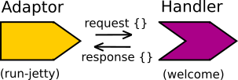

# Create a handler function

There may be a great many routes in a webapp, so to make the code more readable we create a separate function.  In Ring terminology, this function is refered to as a handler.

When you send a request to the webapp, the ring adaptor converts this request to a map and sends it to the specified handler.
 


A handler function takes the request map as its argument and returns a response map.

> **Note** Refactor the code in the `src/todo-list/core.clj` file to create a separate `welcome` handler function that processes all requests
  
```clojure
(ns todo-list.core
  (:require [ring.adapter.jetty :as jetty]))

(defn welcome
  "A ring handler to process all requests sent to the webapp"
  [request]
  {:status 200
   :body "<h1>Hello, Clojure World</h1>  <p>Welcome to your first Clojure app.  This message is returned regardless of the request, sorry<p>"
   :headers {}})

(defn -main
  "A very simple web server using Ring & Jetty"
  [port-number]
  (jetty/run-jetty welcome
    {:port (Integer. port-number)}))
```  
  

## Run the server again 

  Once you have saved your code changes, run the web server again to make sure it still works 
  
```bash
lein run 8000
```

Your webapp should behave exactly as it did before, check by visiting http://localhost:8000.


> Soon we will add a middleware component that will automatically reload any code changes into our running application, so we do not need to restart our webserver each time.

