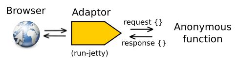

# Use the Ring Library to create a webserver

The Ring library can start an embedded Java server (eg. Jetty, Tomcat) to listen for requests from a browser.  Each browser request received is converted into a request map, a Clojure map with keys and values.  This request map is passed to a handler function, which returns a response map.

  In the section you will discover how to:

* [Add the Ring library as a dependency](add-ring-dependency.html)
* [Including Ring in the namespace](include-ring-library.html)
* [Add a main function to run a Jetty webserver](add-a-jetty-webserver.html)
* [Configure the project's main namespace](configure-main-namespace.html)
* [Run webserver](run-webserver.html)

## Related Theory

We will cover some related theory on [Coersing types](coersing-types-and-java-lang.md) (also known as casting types) to help us deal with Java interoperability.

We will also cover how to manage the scope of your Clojure code with [Namespaces](namespaces.html).

> ####Hint:: We will cover [Ring in more detail](../introducing-ring/index.md) in the next section, once you have your first webserver up and running.
