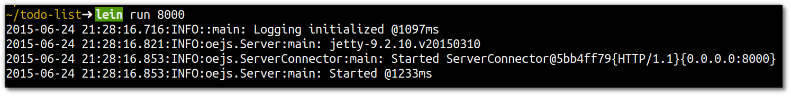
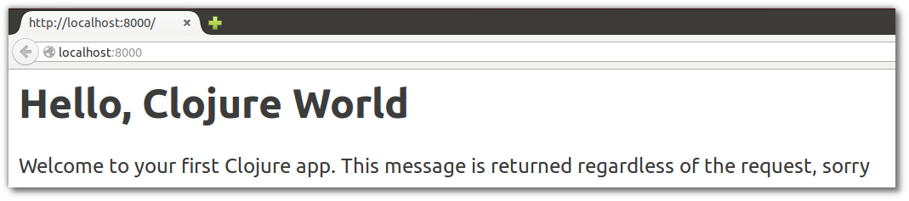

# Run webserver

> ####Note:: Run the webserver we use Leiningen, the Clojure build automation tool.  In the root of your Clojure project, the directory that contains `project.clj`

In a command line terminal, navigate to the root of your project and type the following command

```bash
lein run 8000
```

  This command should start up a Jetty web server that listens on http://localhost:8000.



Open http://localhost:8000 in your browser and try out different pages, such at [/hello]( http://localhost:8000/hello),  [/goodbye]( http://localhost:8000/goodbye) or  [/complete-indifference]( http://localhost:8000/complete-indifference).  It should not matter what page you visit, you should get the same response.



---
