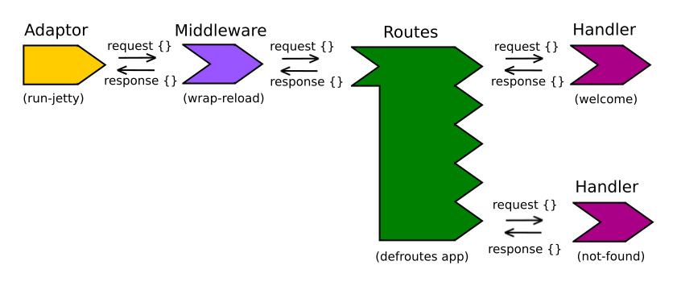

## Application Logic

## Ring

Ring is the defacto library for HTTP messaging.

The Ring specification became the defacto standard in Clojure, converting requests and responses between Clojure Hashmaps and the HTTP format.

## Reitit

A data approach to routing for Clojure and ClojureScript.

[Reitit-ring](https://cljdoc.org/d/metosin/reitit/0.11.0-rc1/doc/ring){target=_blank} uses the Ring standard.

## Compojure

[Compojure](https://github.com/weavejester/compojure) is a library that works with Ring to manage

Compojure also has convenience functions that make ring responses easier to generate.

In this section we will update our project to use Compojure.

## Juxt Bidi

Bi-directional URI dispatch for Clojure and ClojureScript

[Bidi](https://github.com/juxt/bidi) is written to do 'one thing well' (URI dispatch and formation) and is intended for use with Ring middleware, HTTP servers (including Jetty, http-kit and aleph) and is fully compatible with Liberator.

## yada

Resources as data

[yada](https://github.com/juxt/yada) is a web library for Clojure, designed to support the creation of production services via HTTP.

Yada has the following features:

* Standards-based, comprehensive HTTP coverage (content negotiation, conditional requests, etc.)
* Parameter validation and coercion, automatic Swagger support
* Rich extensibility (methods, mime-types, security and more)
* Asynchronous, efficient interceptor-chain design built on manifold
* Excellent performance, suitable for heavy production workloads

yada is a sibling library to bidi - whereas bidi is based on routes as data, yada is based on resources as data.
