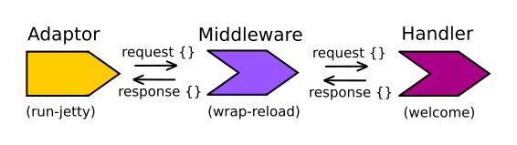

# wrap-reload

  To save ourselves from continually stopping and starting the web server, we can use a middleware component called `wrap-reload`.  
  
  
  
  We only want to use this middleware when we are developing the webapp, so we will create a `-dev-main` function and a `:dev` profile.

> **Note**  Include wrap-reload in the namespace of our project
  
```clojure
(ns todo-list.core
  (:require [ring.adapter.jetty :as jetty]
            [ring.middleware.reload :refer [wrap-reload]]))
```

`:require` allows you to call functions from a different namespace, using their fully qualified name.  Using `:refer` pulls the function into the namespace, just as if you had written the function definition in the namespace.  So using `:refer` allows you to simply call the function by just its name

> **Hint** If you want to include all the functions from another namespace in the current one, you can use `(:require [ring.middleware.reload :refer :all]))`

> Try to use `:refer :all` as little as possible, as it can lead to symbol conflicts (ie. `def` `defn` names).  By refering everything it can also make dependency conflicts and generally add unnecessary complexity to your Clojure application.  In most cases you will refer particular symbols by name.


## Define a function to call only during development 

> **Note** Create a `-dev-main` function similar to the `-main` function, except this time use the `wrap-reload` middleware around the `welcome` function.  Each time you change the `welcome` function definition it will be reloaded.
  
```clojure
(defn -dev-main
  "A very simple web server using Ring & Jetty that reloads code changes via the development profile of Leiningen"
  [port-number]
  (jetty/run-jetty (wrap-reload #'welcome)
     {:port (Integer. port-number)}))
```

The `wrap-realod` function wants to know the name of the function it should reload.  Using the hash and quote characters, **#'**, in front of the `welcome` function tells Clojure to use the name of the the `welcome` function (the var) as the paramter to the `wrap-relod` function.  

Without the **#'** characters, Clojure would evalutate the `welcome` function and pass the result to the `wrap-reload` function.

The **#'** characters are known as the `var macro.

## Configure the dev profile in your project

  When you start your Clojure webapp with `lein run` it looks for main class to run in the `:dev` profile by default.  So we need to create a `:dev` profile.
  
> **Note** Edit the `project.clj` and create a `:dev` profile to define the initial function to call when starting our webapp.

```clojure
:profiles {:dev 
            {:main todo-list.core/-dev-main}}
```

Your `project.clj` file should look like the following:
  
```clojure
(defproject todo-list "0.1.0-SNAPSHOT"
  :description "A simple webapp using Ring"
  :url "http://example.com/FIXME"
  :license {:name "Eclipse Public License"
            :url "http://www.eclipse.org/legal/epl-v10.html"}
  :dependencies [[org.clojure/clojure "1.6.0"]
                 [ring "1.4.0-beta2"]]
  :main todo-list.core
  :profiles {:dev
              {:main todo-list.core/-dev-main}})
```
